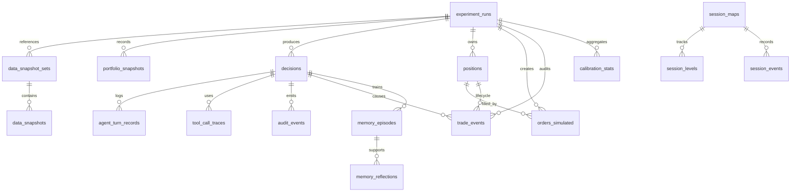

# AlphaPulse Database Schema Model

> Scope: Postgres data model for historical replay now and future live trading.
> Runtime default: `PG_SCHEMA=historical`.

## Runtime Schemas

AlphaPulse uses two application schemas inside the same Postgres database:

| Schema | Purpose | Current Usage |
|---|---|---|
| `historical` | Historical replay, backtest state, simulated orders, decision audit, evaluation, memory | Active runtime schema |
| `live` | Future live trading state with the same table model, kept separate from replay data | Empty by default until live adapters are implemented |

The `public` schema is not used for application tables. It remains available for shared extensions such as `vector` and as a fallback in the connection `search_path`.

The runtime schema is selected by `PG_SCHEMA`; when unset, the code uses:

```text
search_path = historical, public
```

Use `PG_SCHEMA=live` only after live ingestion, broker execution, and live risk controls are implemented.

## Migration Order

Run migrations in order:

```text
001_initial_schema.sql
002_audit_schema.sql
003_runtime_schemas.sql
```

`003_runtime_schemas.sql` creates `historical` and `live`, moves existing application tables from `public` into `historical`, then creates matching empty tables, indexes, and foreign keys in `live`.

## Table Groups

### Experiment And Data Versioning

| Table | Role |
|---|---|
| `experiment_runs` | One historical or future live run; stores config, model, prompt, toolset, data snapshot, and metrics |
| `runs` | Legacy/simple run registry |
| `data_snapshot_sets` | Groups data snapshots used by a run |
| `data_snapshots` | Per-timeframe data hashes and coverage windows |
| `stock_metadata` | Instrument metadata and corporate-action reference data |

### Portfolio, Execution, And Trade Lifecycle

| Table | Role |
|---|---|
| `portfolio_snapshots` | Capital ledger after each decision |
| `positions` | Open and closed simulated or future live positions |
| `orders_simulated` | Historical execution fills, prices, slippage, and charges |
| `trade_locks` | Cooldown and re-entry locks |
| `trade_events` | Durable trade lifecycle audit: entry, exit, target, stop, square-off, rejection |

### Agent Decisions And Audit

| Table | Role |
|---|---|
| `decisions` | Core agent decision record, raw and validated action, DART thesis, validation, outcome, context hash |
| `agent_turn_records` | Raw LLM assistant turns linked to a decision |
| `tool_call_traces` | Tool arguments, results, status, error, and latency |
| `audit_events` | Engine failures, policy events, schema failures, persistence/evaluation errors |
| `agent_checkpoints` | Agent checkpoint payloads for recovery or graph-based workflows |

### Session State And Market Memory

| Table | Role |
|---|---|
| `session_maps` | Per-session state: range, VWAP, gap, regime, current bias |
| `session_levels` | Level lifecycle state for support/resistance/liquidity levels |
| `session_events` | Intraday event stream for observations and state changes |
| `memory_episodes` | Outcome-backed historical setup memories |
| `memory_reflections` | Higher-level lessons derived from episodes |
| `calibration_stats` | Confidence/setup calibration buckets |

## Core Relationships



## Decision Record Contract

Every persisted decision should be reproducible from database state:

| Field | Source |
|---|---|
| `context_data_hash` | Hash of the no-lookahead market package available at decision time |
| `raw_llm_responses` | Raw assistant outputs from the decision loop |
| `tool_calls_json` | Tool calls returned by the agent loop |
| `prompt_version`, `model_name`, `toolset_version` | Run metadata copied onto the decision |
| `validation_outcome` | Accepted or deterministic rejection reason |
| `outcome_json`, `outcome_label`, `outcome_net_r`, `mfe_pct`, `mae_pct` | Post-decision evaluation |

## Historical Vs Live Separation

The two schemas intentionally share the same table model so the core agent engine can be reused later:

```text
historical data source -> same Agent Engine -> historical schema -> simulated execution
live data source       -> same Agent Engine -> live schema       -> broker execution adapter
```

No live runtime should read or write `historical`, and historical replay should not write `live`.
